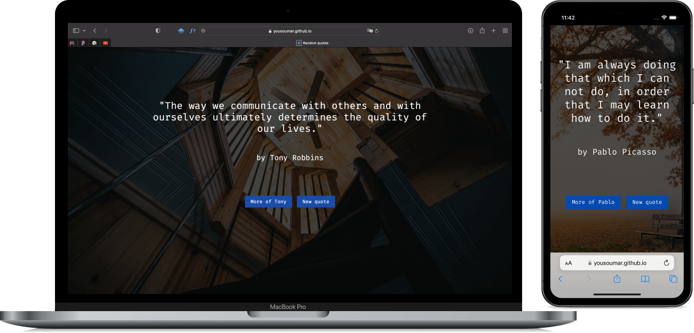

This is a quote generator coded with `React`, where for each quote we have a new background image. The `data` comes from two third-party `APIs`.

The application will notify the visitor in case we could not retrieve the quotes. And in case we do not have the background images, we have one locally which will be displayed.

</img>

